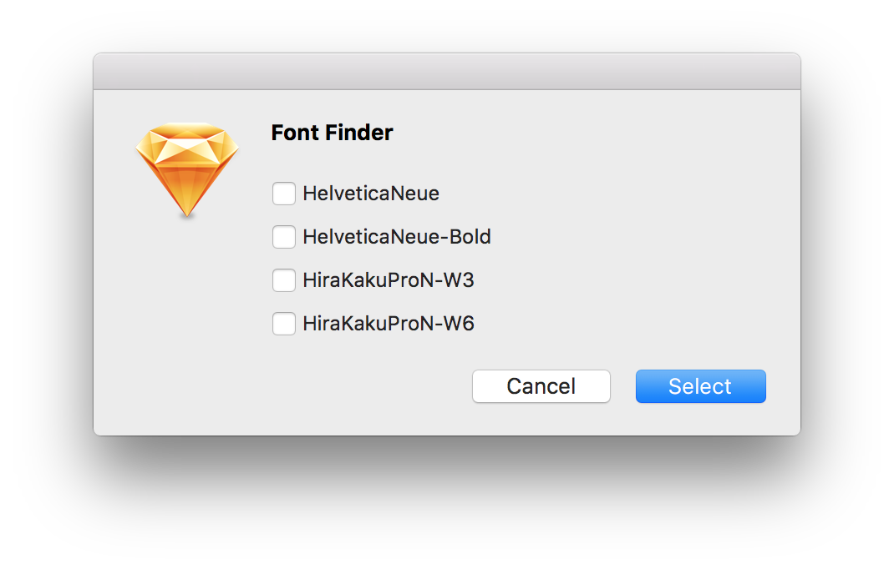

# Font Finder Sketch Plugin

This plugin shows fonts used in a current page and make chosen fonts selected. You can change a specific font at a time or find missing fonts in artboards.

Sketchのページの中で使われているフォントを一覧化し、指定したフォントを選択状態にします。特定のフォントを一括変換したり、いらないけどどこにあるか分からないフォントを探すのに便利です。

## Change Log

**July 13, 2016**

Symbol page available

**July 12, 2016**

Release

## Instration

Download [zip](https://github.com/ukn530/FontSelector/archive/master.zip), unzip the archive and double click .sketchplugin file.

[zip](https://github.com/ukn530/FontSelector/archive/master.zip)をダウンロードして解凍し、.sketchpluginファイルをダブルクリックして下さい。
