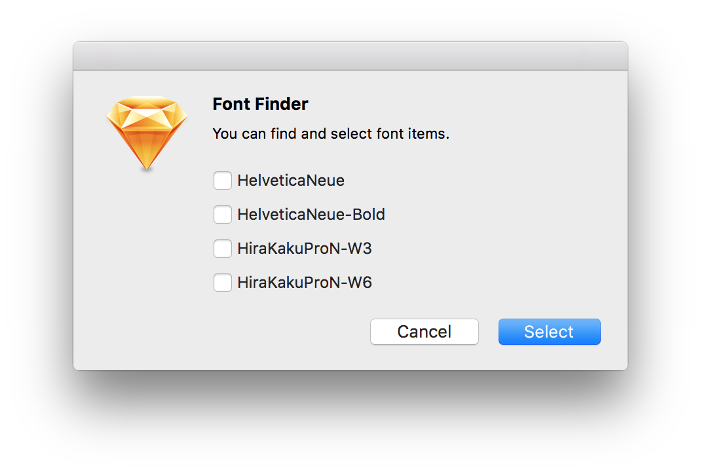

# FontFinder

This plugin lists the fonts used in Sketch's page and puts the specified font into the selected state. It is useful for converting specific fonts in bulk, or for finding fonts that you do not know where.

Sketchのページの中で使われているフォントを一覧化し、指定したフォントを選択状態にします。特定のフォントを一括変換したり、いらないけどどこにあるか分からないフォントを探すのに便利です。

## Change Log

**July 6, 2017**

Fixed a bug for Sketch 45

**July 13, 2016**

Symbol page available

**July 12, 2016**

Release

## Installation

- [Download](../../releases/latest/download/fontfinder.sketchplugin.zip) the latest release of the plugin
- Un-zip
- Double-click on fontfinder.sketchplugin

